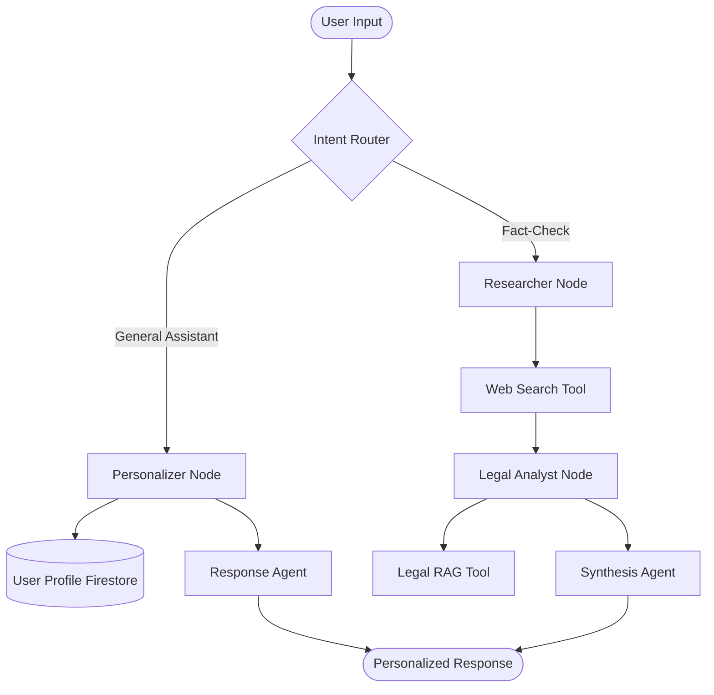

# CivicGuide India 🇮🇳 — AI Electoral Assistant

**CivicGuide India** is a state-of-the-art, agentic AI platform designed to empower the 97 crore voters of India. It provides verified, personalized, and highly accessible guidance on the Indian electoral process using a sophisticated multi-agent orchestration layer.

---

## 🎯 1. Chosen Vertical: Civic & Voter Education

### The Problem
During Indian elections, citizens face three critical challenges:
1.  **Information Fragmentation**: Data about booths, registration, and candidates is spread across multiple portals.
2.  **Misinformation**: Viral "WhatsApp rumors" often mislead voters about their rights or polling dates.
3.  **Accessibility**: Technical and legal jargon makes the electoral process feel intimidating to many.

### Our Solution
A **"Cockpit for Citizens"** that acts as a personalized, agentic guide. Our persona is a **Verified Electoral Assistant** that is neutral, legally grounded, and context-aware.

---

## 🧠 2. Approach & Logic

Our core innovation is the **Multi-Agent Reasoning Graph**. Unlike basic chatbots that use single-shot prompts, CivicGuide uses **LangGraph** to coordinate a team of specialized AI agents for high-fidelity response generation.

### The Agentic Decision Loop
1.  **Intent Routing**: The system identifies if the user needs general info, a polling location, or a fact-check.
2.  **Personalization Node**: The system fetches the user's **Firebase Profile** (State, Constituency, Language) to tailor the response contextually.
3.  **Collaborative Analysis**: For complex queries, agents collaborate in a structured DAG:
    -   **Researcher**: Performs real-time investigation via **Tavily Search**.
    -   **Analyst**: Cross-references findings with the **RPA 1951** via **Legal RAG**.
    -   **Synthesis**: Compiles the final report with a verified verdict.

### Logic Diagram (Mermaid)


---

## ✨ 3. Core Features & Highlights

### 🕹️ EVM & VVPAT Simulator
-   **Tactile Feedback**: A hyper-realistic, industrial-grade simulator that replicates the exact look and feel of an Indian Electronic Voting Machine.
-   **VVPAT Audit Trail**: Simulates the 7-second paper slip audit trail, educating voters on how to verify their vote.
-   **Educational Mode**: Step-by-step guidance on identifying candidates, pressing the ballot button, and confirming the beep.

### 🔍 Fact-Check Engine (Bento Cockpit)
-   **Multi-Agent Orchestration**: Powered by a dedicated **LangGraph** workflow that uses collaborative reasoning between Researcher and Analyst agents.
-   **Cockpit UI**: A high-fidelity, non-scrollable "Cockpit" interface designed to fit the viewport perfectly, with independent scrollable areas for deep-dive reports.
-   **Legal Grounding**: Every check is cross-referenced with the **Representation of the People Act (1951)**.
-   **Official Citations**: Direct links to ECI manuals and press notes provided for every verdict.

### 🤖 Agentic AI Assistant
-   **Contextual Memory**: Remembers previous interactions within a session (**Short-term**) and user preferences across sessions (**Long-term**).
-   **Personalized Onboarding**: Tailors guidance based on the user's voter category (e.g., First-time, Senior Citizen, PWD).
-   **Streaming Responses**: Real-time AI response delivery for a snappy, interactive experience.

### 🗺️ Polling Booth Finder
-   **Visual Map Integration**: Uses **Google Maps** to show precise booth locations.
-   **Official Data**: Integrated with the **Google Civic Information API** (where available) and ECI portals for official polling station details.
-   **Places Autocomplete**: Easy address searching via Google Places.

### ⏳ Interactive Election Timeline
-   **8-Stage Tracker**: Visual guide from the Model Code of Conduct (MCC) to Government Formation.
-   **Actionable Tips**: Key dates and procedural tips provided for each stage.
-   **Dynamic Navigation**: "Ask AI about this stage" deep-links for immediate clarification.

### 🌐 Multilingual & Inclusive
-   **6 Indian Languages**: Support for Hindi, Tamil, Telugu, Bengali, Marathi, and English.
-   **WCAG 2.1 AA**: Fully accessible with screen-reader support and high-contrast styling.
-   **AIBadge Verification**: Transparently labels AI content with links to official sources.

---

## 🚀 4. Google Services Integration

| Service | Application |
| :--- | :--- |
| **Gemini 1.5 Flash** | Core reasoning, RAG, and high-speed chat orchestration via LangChain. |
| **Firebase Auth** | Secure, one-tap login for personalized citizen profiles. |
| **Firestore** | Real-time database for user profiles and conversation memory. |
| **Google Maps API** | Polling booth visualization and address autocomplete. |
| **Civic Info API** | Source of truth for official polling and candidate data. |
| **Cloud Translation** | Real-time localization into regional Indian languages. |
| **Cloud Run** | Scalable, containerized deployment for high election-day traffic. |

---

## 🛡️ 5. Security & Trust

-   **XSS Protection**: Robust input sanitization via `sanitizeInput()` on all user data.
-   **Rate Limiting**: 20 requests/minute per IP to prevent service abuse via `proxy.ts`.
-   **Data Privacy**: All personal context is encrypted and stored securely in Firebase.
-   **Neutrality Promise**: Hard-coded system instructions ensure absolute non-partisanship.

---

## 🏁 6. Getting Started

```bash
# Clone the repository
git clone https://github.com/SouravSohal/electoral_assistant.git

# Install Dependencies
npm install --legacy-peer-deps

# Configure .env.local (Gemini, Firebase, Google Cloud keys)

# Run Development Server
npm run dev
```

---
**CivicGuide India** | Helping India Vote, One Prompt at a Time. | [voters.eci.gov.in](https://voters.eci.gov.in)
