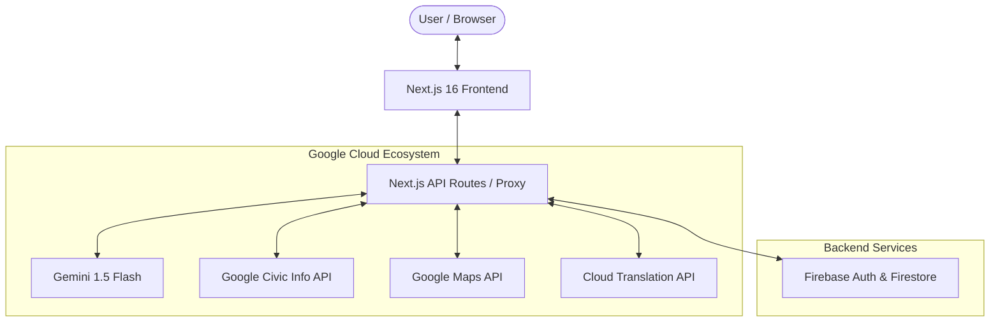
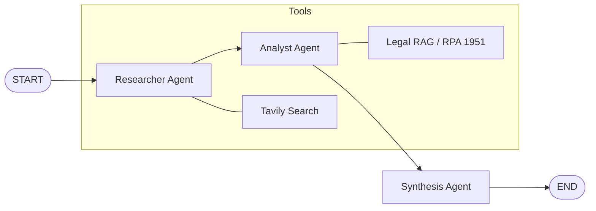

# CivicGuide India — Technical Architecture

This document details the architectural decisions, data flow, and security measures implemented in CivicGuide India.

## 🏗️ System Overview

CivicGuide is built as a modern, agentic web application using **Next.js 16** and **Google Gemini 1.5 Flash**. The architecture is designed to be highly responsive, accessible, and secure, leveraging Google Cloud's ecosystem for AI and civic data.

### High-Level Architecture Diagram

## 🛠️ Core Technology Stack

| Layer | Technology | Rationale |
|---|---|---|
| **Framework** | Next.js 16 (App Router) | Cutting-edge performance with Turbopack and React 19 integration. |
| **Styling** | Tailwind CSS v4 | CSS-first configuration, high performance, and tricolor design tokens. |
| **AI Model** | Gemini 1.5 Flash | High-speed, low-latency agentic reasoning with native tool-calling. |
| **Database** | Firebase Firestore | Real-time user profiling and personalization storage. |
| **Authentication** | Firebase Auth | Secure Google Sign-In for saved locations and personalized timelines. |
| **Deployment** | Google Cloud Run | Scalable, containerized hosting with `output: 'standalone'`. |

## 🔄 Data Flow Analysis

### Multi-Agent Fact-Checking Graph (LangGraph)
The core intelligence of the application is a **Directed Acyclic Graph (DAG)** that orchestrates specialized agents:

1.  **Researcher Agent**: Investigates the query via **Tavily Search** to find live news, official ECI press notes, and verified sources.
2.  **Analyst Agent**: Cross-references findings against the **Representation of the People Act (1951)** and the **Model Code of Conduct** using a local RAG knowledge base.
3.  **Synthesis Agent**: Merges research and legal analysis into a neutral, authoritative report with a clear **Verdict**.
4.  **Short-term Memory**: Managed via **LangGraph Checkpointers** using a `thread_id` to maintain conversation context.

## 🛡️ Security & Reliability

-   **Rate Limiting**: Implemented in `proxy.ts` (Next.js 16 convention) to prevent API abuse (20 req/min).
-   **Content Security Policy (CSP)**: Strict headers configured in `next.config.ts` to prevent XSS and clickjacking.
-   **Zod Validation**: All API request bodies are strictly typed and validated at runtime.
-   **Neutrality**: The Gemini system prompt is engineered for strict non-partisanship regarding Indian political parties.

## ♿ Accessibility (WCAG 2.1 AA)

-   **Semantic HTML**: Proper use of `<nav>`, `<main>`, `<footer>`, and heading hierarchy.
-   **Aria Live Regions**: Used in the chat interface to announce AI responses to screen readers.
-   **Keyboard Navigation**: Full focus-trap and skip-link implementation.
-   **Reduced Motion**: All CSS animations respect `prefers-reduced-motion`.

## 🇮🇳 India Pivot (2026-04-26)

The application was specifically adapted for the Indian electoral context, supporting:
-   **Languages**: English, Hindi, Tamil, Telugu, Bengali, Marathi.
-   **Entities**: ECI, NVSP, Lok Sabha, Rajya Sabha, Vidhan Sabha.
-   **Systems**: EVM, VVPAT, NOTA, Model Code of Conduct (MCC).

## 🚀 Roadmap & Future Implementations

### 📄 Advanced Affidavit Intelligence (Phase 6)
The "proper setup" for candidate verification will evolve from search-based analysis to a high-fidelity audit system:
-   **Multimodal PDF Extraction**: Direct analysis of Form 26 PDFs (Criminal, Financial, Educational) using Gemini's vision capabilities for OCR and table parsing.
-   **ECI Deep Linking**: Automated extraction of ECI serial numbers to provide direct links to the official [affidavit.eci.gov.in](https://affidavit.eci.gov.in) portal.
-   **Constituency Mapping**: Integrating candidate lists directly into the Polling Booth Finder based on the user's geographic location.

### 🗺️ Real-time Booth Analytics
-   Crowdsourced "Wait-time" reporting for polling booths.
-   Accessibility-first pathfinding for PwD voters within booth premises.
