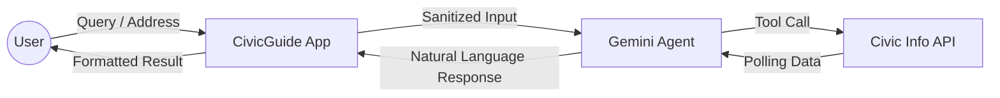

# CivicGuide India — Technical Architecture

This document details the architectural decisions, data flow, and security measures implemented in CivicGuide India.

## 🏗️ System Overview

CivicGuide is built as a modern, agentic web application using **Next.js 16** and **Google Gemini 1.5 Flash**. The architecture is designed to be highly responsive, accessible, and secure, leveraging Google Cloud's ecosystem for AI and civic data.

### High-Level Architecture Diagram

## 🛠️ Core Technology Stack

| Layer | Technology | Rationale |
|---|---|---|
| **Framework** | Next.js 16 (App Router) | Cutting-edge performance with Turbopack and React 19 integration. |
| **Styling** | Tailwind CSS v4 | CSS-first configuration, high performance, and tricolor design tokens. |
| **AI Model** | Gemini 1.5 Flash | High-speed, low-latency agentic reasoning with native tool-calling. |
| **Database** | Firebase Firestore | Real-time user profiling and personalization storage. |
| **Authentication** | Firebase Auth | Secure Google Sign-In for saved locations and personalized timelines. |
| **Deployment** | Google Cloud Run | Scalable, containerized hosting with `output: 'standalone'`. |

## 🔄 Data Flow Analysis

### AI Agent Interaction (DFD)

The "Agentic" nature of the application comes from how Gemini interacts with external tools.

1.  **Sanitization**: All user input is stripped of HTML and scripts via `sanitizeInput()` before reaching the AI.
2.  **Contextual Routing**: The agent decides whether to answer from internal knowledge (e.g., "What is NOTA?") or fetch real-time data (e.g., "Where is my polling booth?").
3.  **Proxy Layer**: All sensitive API keys are kept server-side. The frontend communicates with `/api/*` routes.

## 🛡️ Security & Reliability

-   **Rate Limiting**: Implemented in `proxy.ts` (Next.js 16 convention) to prevent API abuse (20 req/min).
-   **Content Security Policy (CSP)**: Strict headers configured in `next.config.ts` to prevent XSS and clickjacking.
-   **Zod Validation**: All API request bodies are strictly typed and validated at runtime.
-   **Neutrality**: The Gemini system prompt is engineered for strict non-partisanship regarding Indian political parties.

## ♿ Accessibility (WCAG 2.1 AA)

-   **Semantic HTML**: Proper use of `<nav>`, `<main>`, `<footer>`, and heading hierarchy.
-   **Aria Live Regions**: Used in the chat interface to announce AI responses to screen readers.
-   **Keyboard Navigation**: Full focus-trap and skip-link implementation.
-   **Reduced Motion**: All CSS animations respect `prefers-reduced-motion`.

## 🇮🇳 India Pivot (2026-04-26)

The application was specifically adapted for the Indian electoral context, supporting:
-   **Languages**: English, Hindi, Tamil, Telugu, Bengali, Marathi.
-   **Entities**: ECI, NVSP, Lok Sabha, Rajya Sabha, Vidhan Sabha.
-   **Systems**: EVM, VVPAT, NOTA, Model Code of Conduct (MCC).
